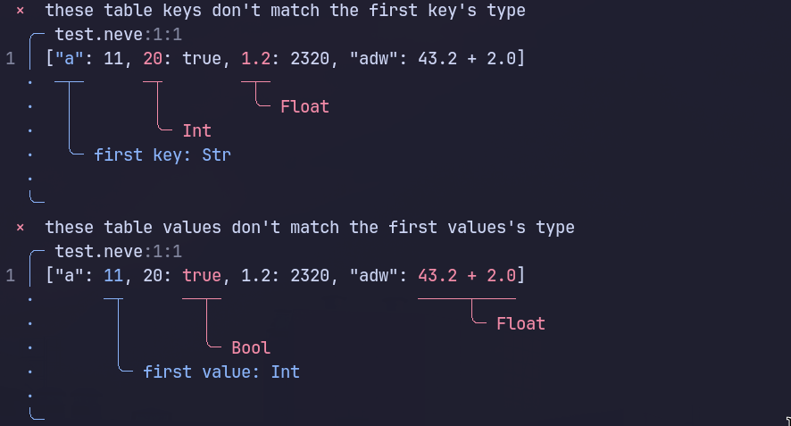

# Neve

Neve is a hybrid-paradigm interpreted programming language that favors functional programming.  It is designed
to be not only easy, but *fun* to use, while also being predictable and expressive.  It is designed to *never crash*.

I’m writing this as an informal specification for the language because I really wanted to get my thoughts out.  I’ve 
been spending a couple years coming up with a language that would be fun to use for my non-performance critical 
side projects, and that could also hopefully be fun to use for you too!  And I’d really like to know what your thoughts
are.  If I’ve missed anything or something seems confusing, please kindly let me know!

And, just in case you’re curious–development started a couple months ago, but it’s been going pretty slowly.  
Neve barely supports anything, and I’m working on rewriting the whole bytecode compiler from Python to Kotlin 
because Python’s been causing a mess, so I wouldn’t recommend trying to write any programs yourself just yet.  If
you still want to check it out, you’re welcome to visit [nevec](https://github.com/neve-lang/nevec) and 
[neve](https://github.com/neve-lang/neve).

# Table of Contents 

* [Core Philosophy](#core-philosophy)
* [Quick Syntactical Overview](#quick-syntax-overview)
* [Main Features and Semantics](#main-features-and-semantics)
* [Conclusion](#conclusion)

## Core Philosophy

With every new language comes a same question: **why use it over another language**?  This essentially comes down 
to what the language itself brings, why it was made in the first place, and what makes it unique.  This section 
will mainly involve words of mouth.

Neve’s core principles are the following: **expressiveness**, **safety and predictability**, and **awesome DEVX**.  

### Expressiveness

Neve tries to achieve expressiveness by **favoring functional programming**.  It still supports `while` and `for` loops 
due to its hybrid nature, but it makes it clear that functional constructs are preferred wherever possible, by doing 
tiny things like [requiring the `for` loop variable to be mutable](#variable-mutability).

Neve also tries to achieve expressiveness by using what I like to call its **soothing syntax**, but it’s difficult to 
hit the mark with syntax–it’s not objective, and it spends a lot of the language’s strangeness budget.  But for 
Neve, I tried sacrificing some of that strangeness budget to bring something fresh and that isn’t found as often 
as in other languages–that is, Lua and Ruby-like syntax.

### Safety and Predictability

Neve values safety and predictability *a lot*, so much so that it intends to be *a language that never crashes*.  
Now, of course, Neve *will* crash if you run into fatal issues like a heap corruption error, or if you manually write 
a valid Neve bytecode file that does unsafe things.  But in a regular setting, your code should *never crash* because of
a runtime error–those don’t exist in Neve, thanks to its [refinement types](#refinement-types) and deep value analysis.

Now, I understand that those are bold claims to make, and it’s easy to ask yourself, “if Neve plans to
do it, why haven’t other languages already done it?”  But my answer to this question is, I think it’s expected to have 
new ideas emerge over time.  For example, Java is a widely used language, and yet, it didn’t support null safety until Java 
1.8, introducing its `Optional` class.  And, most languages just don’t have the goal to be a language that never crashes, or 
at least don’t prioritize it.

And, if you’re still skeptical, I completely understand.  This `README` aims to answer every question you might be 
asking yourself right now, and if you see an issue I hadn’t caught, please let me know!

### Awesome DEVX

The last of those core points can’t really be proven by language features, and with a compiler and VM still under heavy 
development, the best I can show you are Neve’s compiler error messages.  So here’s one:



## Quick Syntactical Overview

In this section, I’ll try to give you a quick taste for Neve’s syntax, without dumping too many language 
features at once and without talking about syntax forever.  This means that I’ll have to keep the example simple, 
but that’s okay.  With that said, here’s a simple Neve program:

```rb
fun main
  let numbers = 0..10

  # Initial numbers: [0, 1, 2, 3, 4, 5, 6, 7, 8, 9, 10]
  puts "Initial numbers: #{numbers}"

  let evens = numbers.filter with Int.is_even
  let doubled = evens.map |x| x * 2

  puts "Then: " if doubled.is_empty = "No doubled evens!" else doubled.show
end
```

It’s a silly program, but hopefully, it gives you a clear vision of what Neve aims to achieve.

A couple things you might’ve noticed:

* Newlines are significant in Neve.  [How are they treated at the parser level?](#newlines-in-neve)
* Parentheses to call a function are optional in Neve.  [How does the parser handle that?](#function-calls-with-optional-parentheses-in-neve)

These questions dive into how the parser and lexer themselves work, so I’ll leave them at the bottom of this 
`README`, just in case you’re interested!

## Main Features and Semantics

This section dives into Neve’s essential features and semantics, like immutability, pattern 
matching, refinement types, and more.

### Variable Mutability

In Neve, variables are declared using either a `let` keyword or a `var` keyword.  À la Swift, `let` is used to specify 
immutability, whereas `var` is used for mutable variables.  

```rb
fun main
  let name = "Name"
  var age = 20

  # okay:
  age += 1 
  # not okay:
  name = "Other name"
end
```

It is also worth noting that `for` loops require mutable variables:

```rb
fun main
  var i = 0
  for i < 10 where i += 1
    puts i
  end
end
```

### First-class Functions

As any other functional programming language, Neve supports first-class functions.  However, there’s a problem: as we
mentioned before, Neve allows functions to be called without parentheses, so how is this ambiguity solved?  Neve 
introduces a `with` keyword that returns the given function as a first-class citizen:

```rb
fun is_even(n Int)
  n mod 2 == 0
end

fun main
  let numbers = 0..10

  # this fails: there’s missing arguments!
  let evens = numbers.filter is_even
  # this is okay
  let evens = numbers.filter with is_even
end
```

However, it is worth nothing that `with` is unnecessary for anonymous functions; those are treated as first-class citizens 
by default.

```rb
fun main
  let numbers = 0..10

  # this fails!
  let evens = numbers.filter with |x| x mod 2 == 0
  # this is okay
  let evens = numbers.filter |x| x mod 2 == 0
end
```

### Type System

Neve features a type system similar to those found in many programming languages, taking a lot inspiration from 
Rust’s type system, as well as common and successful approaches to union types.  This `README` does not go over every 
single type available in Neve’s type system–I’ll try keeping only the most essential ideas without making things confusing.

#### Records

Records are the same as the `struct`s you love in other languages.  In Neve, a record is declared using the `rec` keyword, 
followed by the record’s name, and its fields.

```rb
rec Hero
  name Str
  sword Sword
end
```

Records are constructed using the `with ... end` syntax, where all fields must be instantiated, separated by newlines.

```rb
fun main
  let sword = Sword.Iron

  let hero = Hero with
    name = "Name"
    sword # shorthand syntax
  end
end
```

Empty records are also valid:

```rb
rec Empty
end

fun main
  let empty = Empty with ..
end
```

#### Ideas

Neve’s `idea`s are analogous to Rust’s `trait`s: there’s basically no difference between them, except for the keyword.  
An `idea` is must have associated functions; it can also have associated types, and multiple generic types.

```rb
idea Speak
  fun speak Str

  fun scream
    # immutable self can be implicit
    self.speak.uppercase
  end
end
```

To let a type share an idea, you use the `idea I for T` syntax, where `I` is the idea, and `T` refers to the type.

```rb
rec Dog
end

idea Speak for Dog
  fun speak
    "Bark!"
  end
end

fun main
  let my_dog = Dog with ..

  # Bark!
  puts my_dog.speak 
  # BARK!
  puts my_dog.scream
end
```

You can also use the `idea for T` syntax to attach associated functions to a type without needing an explicit idea.

```rb
idea for Dog
  fun walk
    puts "Walking"
  end
end
```

#### Errors and Null Safety in Neve

Neve takes a very similar approach to Zig and Kotlin’s when it comes to what I like to call *dangerous union types*: those 
being optional types and error types.  

##### Optional Types

In Neve, a possibly `nil` type is written as `T?`, where `T` refers to the type.  For example, retrieving a value from a table 
will result in an optional type:

```rb
const My
  # Table has type [Str: Int]
  Table = ["a": 1, "b": 2]
end

fun main
  let my_value = My.Table["x"]
  # my_value has type Int?
  # NOTE: in this particular example, the compiler will be able to infer 
  # that my_value is always nil; its type remains an Int?, however.
end
```

Optional types can be assigned freely without needing a type wrapper or typeclass, as long as the assignment is valid:

```rb
fun main
  var mystery Int? = mystery_fun

  mystery = 10
  mystery = nil
end
```

##### Error Types

In Neve, errors are treated as values.  Neve also provides an *error union type*, written as `T!E`, where `T` is the type and
`E` is the error.

Notice how it is `T!E` and not `T | E`–that’s because `T | E` doesn’t allow using the `.or` and `.else` associated 
functions; which we’ll get to soon, whereas `T!E` does.

```rb
fun read(filename Str)
  # file has type `File!FileErr`
  let file = File.read filename
  # ...
end
```

Error types can be defined as follows:

```rb
union IsClosedErr for !
  | CameTooEarly
  | CameTooLate
end
```

Weird syntax, right?  But there’s reasons behind it.  I felt like introducing an `err` or `error` keyword would get in 
the way of people trying to write `let err = dangerous_fun`.  I’ve even considered the silly approach of checking if 
the union’s name ends with `Err` or `Error`...  In the end, I decided to go with `union E for !`, which shouldn’t be that bad.

An advantage of *dangerous union types* is that they come bundled with the `.or` and `.else` associated functions, which 
don’t show up anywhere else.  Normally, `or` and `else` would be considered reserved keywords, but when used with `T?` or 
`T!E`, they work just like Rust’s `.unwrap_or()` or `.unwrap_or_else()` functions, respectively.  Here’s an example:

```rb
union SomeErr for !
  | SomethingWentWrong
end

fun maybe_nil Int?
  random.either for Int? 10, nil 
end

fun maybe_err Int!SomeErr
  random.either for Int!SomeErr 10, SomeErr.SomethingWentWrong
end

fun main
  let a = maybe_nil.or 20
  let b = maybe_nil.else do
    puts "I don’t want a nil!"
    20
  end

  let c = maybe_err.or 20
  let d = maybe_err.else |e| do
    puts "To #{e}: May I ask what went wrong?"
    20
  end
end
```

#### Refinement Types

Refinement types are Neve’s main selling point.  In Neve, a refinement type is a type that must fulfill a certain condition 
*at compile time*.  They’re essential for input validation and are what makes Neve’s goal of being a language that never 
crashes possible.

Refinement types are defined using `let`, followed by the name of the type, and a `where` clause.  Here’s an example:

```rb
let Nat = Int where self >= 0
```

> Using `let` here isn’t ambiguous, because *variable declarations aren’t allowed at top level code*; only `const` 
declarations are.

This defines a refinement type called `Nat`, which is an integer that *must* be above or equal to zero.  `self` can also 
be renamed in case of name conflicts:

```rb
let Nat = Int where |i| i >= 0
```

Now, **how is this checked at compile time**?  Neve plans to implement a **value analysis** phase in the compiler that 
runs alongside the type checker; the type checker validates a node, and then hands it over to the **value analyzer** that 
gathers just enough information to help out the type checker.  Implementing the value analyzer won’t be easy, but it’s
definitely possible.  I’ll share the implementation once it’s been proven to work!

What’s awesome about refinement types, is that they allow us to validate *anything* at compile time, without needing 
runtime checks that lead to a crash.  For example; say goodbye to the old “index out of bounds” error, because this 
prevents it now:

```rb
let InBoundsOf(list List) = Nat where self < list.len

idea Subscript
  let Index
  let Out

  fun subscript(index Index) Out
end

idea Subscript for List T
  fun subcript(index I) T
  with I = InBoundsOf self
    alien # C implementation
  end
end
```

So now, this:

```rb
fun main
  let list = 0..10
  puts list[5]
end
```

Is okay, because the compiler will be smart enough to know that `5` is proven for `ListIndex 0..10`, but this:

```rb
fun main
  let list = 0..10
  let index Int = fun_with_unknown_return_range

  puts list[index]
end
```

Is not–the compiler cannot prove `ListIndex 0..10` for `index`.  This can be solved with an `if` statement, which
alters `index`’s possible values due to **timeline** (just a fancy name for branching scopes, hehe) analysis:

```rb
fun main
  let list = 0..10
  let index Int = fun_with_unknown_return_range

  # syntactical sugar for checking the `where` clause
  if index is not InBoundsOf list
    puts "Okay, we won’t check list" 
    return
  end

  puts list[index]  
end
```

## Conclusion

I hope this was an interesting read!  I tried to keep this `README` concise enough while still being thorough, and I’d like 
to thank you if you’ve read this far!  Sincerely, you’re the best.

I know the whole “never crashing idea” is ambitious, and I definitely expect some skepticism about everything else–this is 
all a lot of unproven theory, after all.  But I think I’d really appreciate it if you could be supportive, even if you 
can’t shake off your skepticism easily.  Neve is my passion project, and even if I can’t bring my ideas to life, at least 
it’ll have inspired someone else to create something perhaps equally awesome!

---

### Newlines in Neve

As mentioned before, newlines in Neve are significant whitespace.  But there seems to be a lot of discussion 
regarding the best way to implement a parser that supports them.  I think Neve’s approach to this problem is interesting, 
and felt like sharing it just in case it inspires someone’s approach to the same problem!  You’re welcome to skip this section 
if you’re not interested.

Neve’s approach is simple–it ignores any type of whitespace *unless it’s required*.  Now, before you roll your eyes: I 
promise it’s not just like JavaScript does.  Let me explain in detail.

During the parsing phase, the Neve Lexer skips all kind of whitespace *except* for newlines.  For these kinds of characters, 
it emits a **newline token** that is passed over to the parser, just like a normal token.

However, this is where the interesting part happens–because Neve uses a single-pass parser, the parser keeps two tokens 
in memory at every state: a `previous` token and a `current` token.  They’re pretty straightforward–when the `current` token
changes, the `previous` token is set to `current`’s previous value, and then we continue.  However, the parser treats 
**newline tokens** a bit differently.  Whenever it calls `advance()` or a function that moves the parser’s position forward, 
it *skips every newline token*, and once they’re all skipped, the last newline token stays in `previous`, because `current` 
just skipped it.  This lets the parser skip every newline token it doesn’t need, and it just has to check if the `previous` 
token is a newline token to know if there was a newline.  This can easily be abstracted away in a tiny `hadNewline()` 
function.

### Function Calls with Optional Parentheses in Neve

Optional parentheses are another can of worms, and I thought clarifying how Neve handles that could also be valuable.  Same
as before–you’re free to skip this section if you want to.

The decision to keep parentheses optional when calling a function in Neve makes its syntax ambiguous.  For example, take 
a look at this tiny snippet:

```rb
let seeds = plant
```

Is this a declaration of a variable `seeds` that is assigned the value of some *other variable* named `plant`, or is it 
a declaration of a variable `seeds` that is assigned the returned value of some *function* named `plant`, that takes in 
no arguments?

Neve solves this ambiguity **during its semantic resolving** phase, where it takes the original AST and outputs a 
corrected version, solving ambiguities that can only be solved if we have extra information about symbols.  In this case,
`plant` is considered a simple access of the variable `plant` *if it is, indeed, a variable*, but it will be considered a 
function call *if it is a function call*.

Then, we have less ambiguous function calls: those are function calls that have arguments provided.  The Neve parser 
considers something a function call if it sees an identifier followed by:
* An **expression starter token** *with no newline token before it*.
* A parenthesis *with no newline token before it*.

This means that the following will be considered function calls in Neve:

```rb
let a = call
let b = call x, y, z
let c = call(x, y, z)
let d = call(
  x,
  y,
  z
)
let d = some.call.this.and_that(x, y, z)
        #    ---- ---- -------- will be called if they are associated functions
        #                       (this is done by the semantic resolver, which
        #                        examines the AST and outputs a corrected version.)
```

But the following *won’t*:

```
# doesn’t capture the arguments
let a = call
("Hello")

# the following example is weird:
let a = call var x = 10
# this actually gets parsed as:
let a = call
var x = 10
# because `var` is not an expression starter token.
```

Neve considers the following tokens **expression starters**:
* Opening bracket tokens: `(`, `[`, `|`
* Identifiers
* Strings, integers and floats
* Expression or expression starter keywords: `true`, `false`, `nil`, `not`, `self`, `with`
